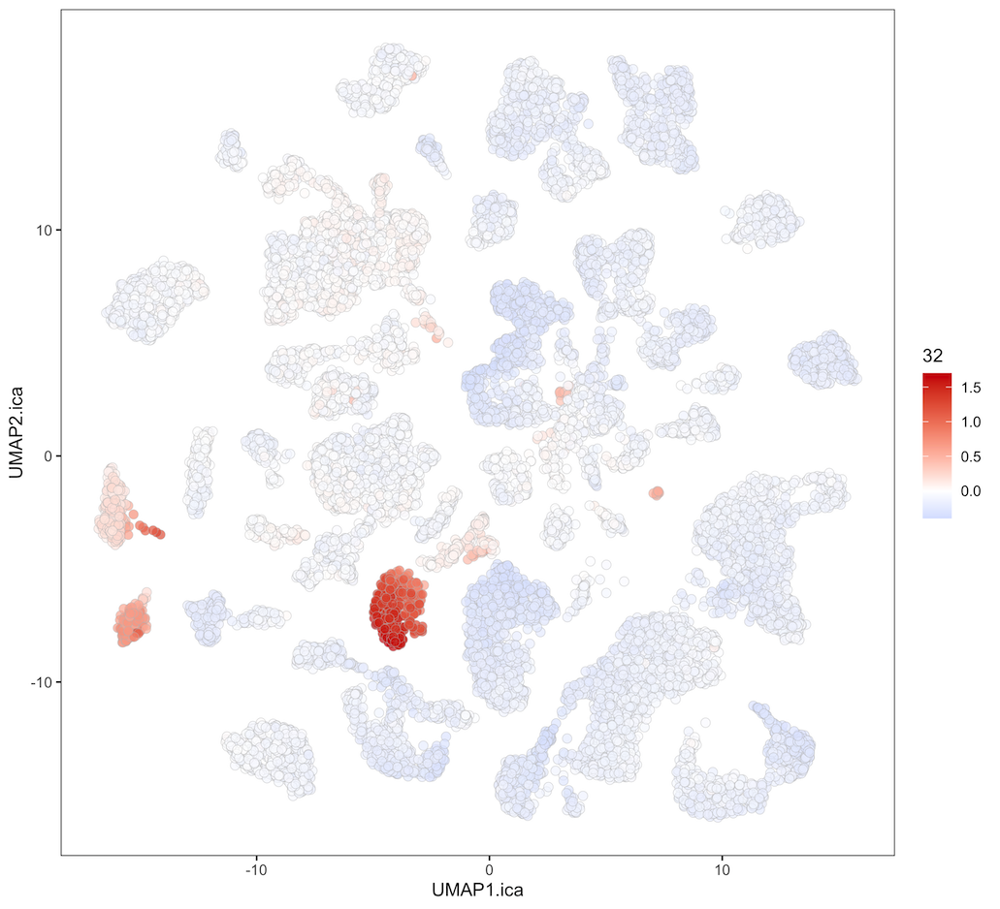
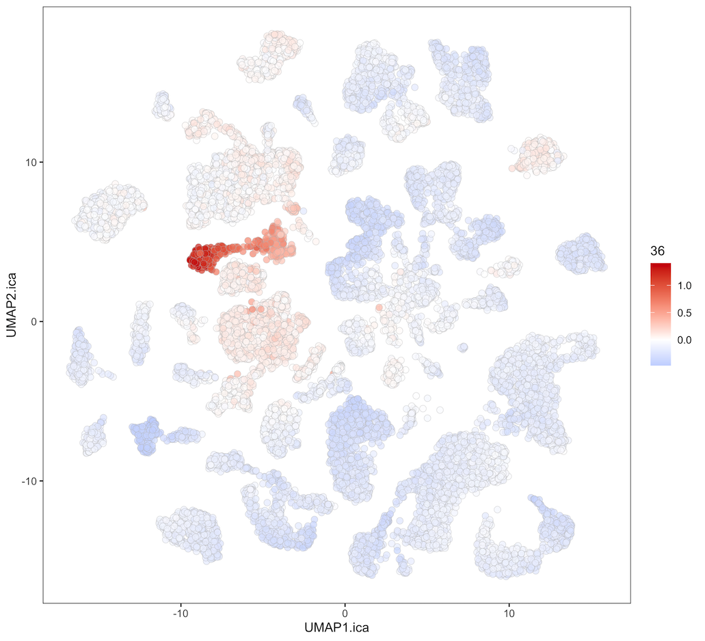
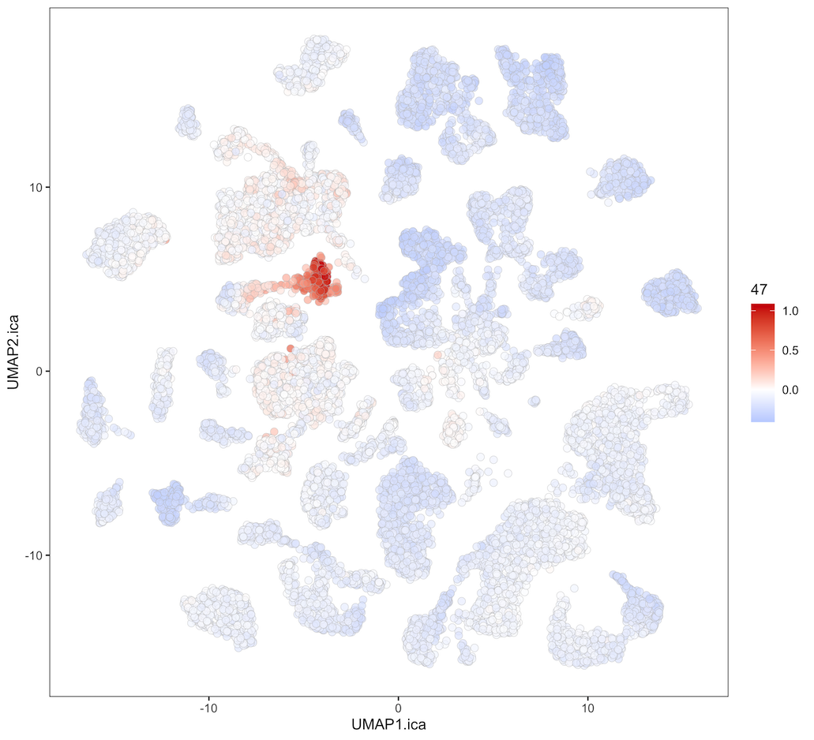
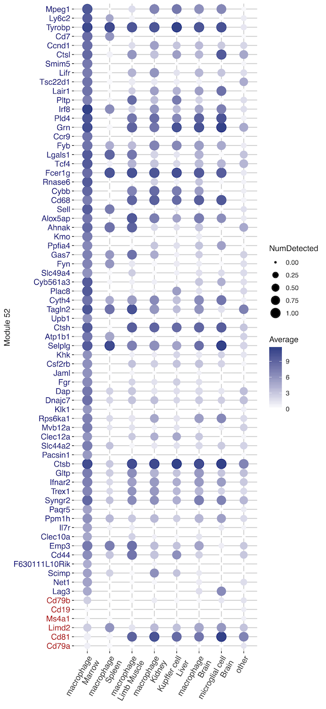
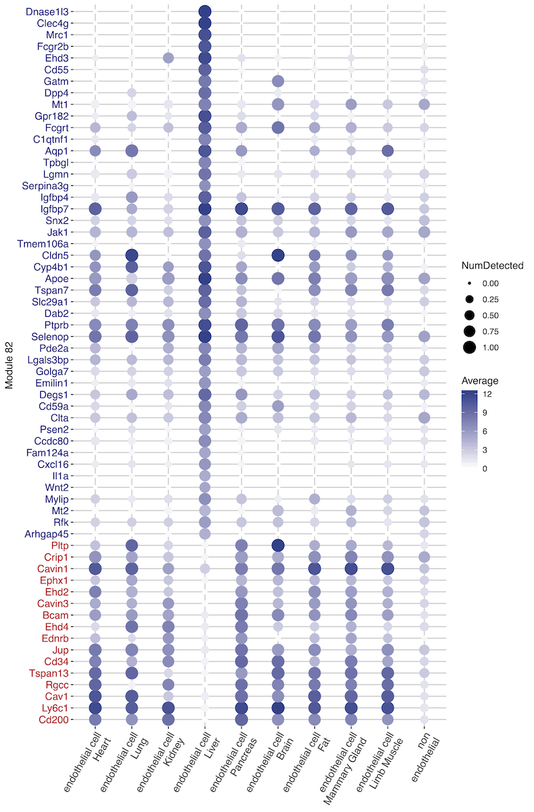

Modular Decomposition of Cell Identity - Summary
================
Aleks Dakic

  - [1. Intro](#intro)
  - [2. The Works](#the-works)
      - [2.1 ICA model and analysis
        workflow](#ica-model-and-analysis-workflow)
      - [2.2 Consensus ICA and selecting optimal number of
        components](#consensus-ica-and-selecting-optimal-number-of-components)
      - [2.3 Learning the universal and tissue-specific
        components/factors associated with cell
        identities](#learning-the-universal-and-tissue-specific-componentsfactors-associated-with-cell-identities)
      - [2.4 Extracting key gene modules associated with cell
        identities](#extracting-key-gene-modules-associated-with-cell-identities)
      - [2.5 Validating and refining the content of modules in a cell
        type-specific
        way](#validating-and-refining-the-content-of-modules-in-a-cell-type-specific-way)
      - [2.6 Characterising module gene co-expression across cell
        types](#characterising-module-gene-co-expression-across-cell-types)
  - [3. Remarks](#remarks)

-----

## 1\. Intro

-----

Cell identity is defined as a cell’s capacity to perform a unique
combination of context-dependent molecular functions. The range of these
molecular functions is constrained and regulated by complex regulatory
circuits, many of which act through regulation of RNA expression. As a
result, quantification of gene expression can be used as a reliable
approximation of cell’s unique functional potential and therefore cell’s
identity.

To describe elementary molecular functions that constitute cell’s
identity we need more than individual “best predictor” genes. Gene
expression is inherently modular – groups of genes are co-expressed
across cell types, cell states and microenvironmental conditions. More
importantly, co-expressed genes tend to be functionally related in a
sense that they interact to perform a distinct molecular function, and
are often co-regulated (Eisen et al., 1998; Hartwell et al., 1999). The
elementary functional modules can be isolated or connected to each
other, to various extent, giving rise to higher-level functions and
biological processes that define the cell. Apart from merely inferring
the composition of modules, related fundamental questions in biology
are:  
\- how are individual genes and module as a whole transcriptionally
regulated to form a transcriptional programme  
\- how does the interaction between module genes create a molecular
function  
\- how are modules connected to each other to form more comprehensive
biological networks that define the cell  
\- which of these connections are constitutive, essential parts of
cell’s identity and which are under dynamic regulatory influence of
the microenvironment (here by “connection” we broadly mean interaction,
co-expression and/or regulation)

Biological variation captured by contemporary scRNA-seq experiments can
now be used for genuinely data-driven re-definition of cell identities
in terms of joint activity of discrete number of key modules and
transcriptional programs (Wagner et al., 2016). This can be seen as a
significant step further from focussing on cell morphology, marker genes
and genomic signatures that are selected as independent top
representatives of underlying cell type-specific molecular programs and
can often suffer from the “curse of collinearity” (Crow and Gillis,
2018; Venet et al., 2011).

Naturally, the modularity in gene expression assists in robust
factorisation of scRNA-seq data – it enables its low-dimensional
representation in the form of discrete number of transcriptional
programs and reduces uncertainty in individual gene measurements
(Heimberg et al., 2016). More importantly, focusing on entire modules as
elementary units brings robustness to transcriptional regulatory
networks inference as the next step of biological inquiry (De Smet and
Marchal, 2010).

There are many ways to identify modules in large biological datasets
that can roughly be grouped into clustering, biclustering, decomposition
and network inference methods. In this work we use a combination of
independent component analysis (ICA) and regularised multinomial
logistic regression to decompose scRNA-seq expression profiles into
sparsely encoded and sparsely used modules of co-expressed genes capable
of discriminating cell identities across organism-wide atlas of mouse
cells, Tabula Muris (The Tabula Muris Consortium et al., 2018).

ICA learns a linear mixture of statistically mutually independent latent
variables (components or factors) in data by decomposing it in two
matrices (Hyvärinen and Oja, 2000). In the context of scRNA-seq
experiment, this translates to a matrix of gene weights and a matrix of
cell scores. A gene-focused matrix of sparse, independent components
represents the contribution of each gene to a particular component and
forms the basis for definition of gene co-expression modules. A
cell-focused matrix, on the other hand, describes the extent of
activation of each module in each cell. In reality, when strict
statistical independence cannot be found for the desired number of
components, this translates to finding maximally independent components
(Hyvärinen, 2013). Hence, some of the useful characteristics of the
ICA-based decomposition in this context are the sparsity of gene
components and consequential ability to extracts “as independent as
possible” modules, while simultaneously allowing for some gene-sharing
between them. The ability of a gene to participate in more than one
module or transcriptional program is very natural in biological
networks, but it is not inbuilt in most clustering based methods for
module identification. Another important characteristic, shared with
biclustering, is ability of ICA to detect both local and global patterns
in data, which is crucial for finding patterns in heterogeneous
single-cell samples. Furthermore, unlike principal component analysis
(PCA) and factor analysis, ICA seeks independence of components through
their non-Gaussianity, which enables recovery of some unique underlying
signals in data (Hyvärinen, 2013). Interestingly, recent comprehensive
assessment of 42 methods for module detection based on population based
gene expression data found ICA to be the best performing method across
numerous criteria (Saelens et al., 2018).

In addition to extraction of gene co-expression modules, we used cell
scores in ICA-derived low-dimensional space as predictors in regularised
multinomial logistic regression to identify sparse combinations of
cell-type discriminating modules. The identified co-expression modules
could abstractly be understood as an output from underlying, latent
processes that cannot be directly observed in the gene expression data –
in this case most likely combined activity of transcription factors,
epigenetic and microenvironmental signalling events. To find out more
about regulatory side of some of these latent processes, we investigated
module gene and transcription factor co-expression in a cell
type-specific manner. This revealed fine changes in module correlation
structure (sub-modularity) across cell types and putative
transcriptional regulators behind the key cell type-discriminating
modules.

In an effort to identify both universal and tissue-specific gene
co-expression modules that underpin cell identities across tissues, we
focus in particular on macrophages and other myeloid blood cells, as
well as endothelial cells that are distributed across multiple tissues.
However, the approach can be extend to any focused combination of cell
types that multinomial logistic regression model can handle. The fact
that the background “universe” for any such focused analysis are modules
identified from nearly all cell types of an organism contributes to
generalisability of the results.

-----

## 2\. The Works

-----

### 2.1 ICA model and analysis workflow

The objective of applying ICA to gene expression data is to find a
linear combination of maximally statistically independent latent
variables (components or factors) in data, which represent underlying,
unobserved processes that drive complex gene expression patterns. We
usually think of these underlying processes as joint activity of
transcription factors, epigenetic and microenvironmental signalling
events. In the context of cell identity, out of these three, the
influence of transcription factors is likely the most relevant and in
the same time most inferable from single-cell gene expression data.
While strict assumption of statistical independence between such latent
processes would be unrealistic, we expect that they are relatively
independent from each other, and that ICA’s ability to extract “as
independent as possible” components from data aligns well with
identification of such processes.

As many other matrix factorisation models, ICA decomposes the expression
of gene
 in cell
 as   
  

Here  is the contribution of component
 to gene
 expression (and
likewise the contribution of gene
 to component
, if we rather focus on
the component  as a unique gene co-expression pattern in data);
 is
the extent of activation or usage of component
 by cell
. What is specific to
ICA compared to most other matrix decomposition models is that
components  are made maximally independent by maximising their
non-Gaussianity. This feature gives them more than just decorrelation of
Gaussian models and also makes them naturally sparse (Hyvärinen, 2013).
We used fastICA algorithm in which non-Gaussianity is measured by
negentropy (negative differential entropy),
=H(z)-H(s)"), which is approximated using
![J(s)=\[E(G(s))-E(G(z))\]^2](https://latex.codecogs.com/png.latex?J%28s%29%3D%5BE%28G%28s%29%29-E%28G%28z%29%29%5D%5E2
"J(s)=[E(G(s))-E(G(z))]^2")

Here  denotes entropy,
 is a contrast function
– in our case
"), and  is a
standard normal variable (normal variable with same mean and variance as
independent components s – which, in ICA, are centred at zero and
normalised to unit variance). The basis for using entropy as a measure
non-Gaussianity is a fundamental result of information theory that a
Gaussian variable has the largest entropy among all random variables of
equal variance. Maximising the above cost function therefore leads to
finding independent components with minimum entropy, or maximum
concentration on certain value – in ICA, components have a sharp spike
at zero, which gives them natural sparsity.

 **Figure 1. A
schematic overview of our workflow:** how gene weights in
**** components
are used to extract modules of co-expressed genes that represent
maximally independent patterns in data, and how cell weights in
****
components are used to find most critical combination of such modules
that explain various cell identities.

-----

### 2.2 Consensus ICA and selecting optimal number of components

Unlike PCA, ICA solves local optimisation problem, so it is desirable to
asses stability of extracted independent components. In addition, the
number of independent components (dimensionality of latent space) is a
parameter that needs to be chosen or estimated. We chose to work on
these two problems simultaneously by initially performing 100
replications of ICA, for each number of components parameter value in
the range 50-250, with increments of 50.

The independent components from 100 replications of ICA for each number
of components parameter value are clustered based on their spearman
distances using partitioning around medoids (PAM) method, and consensus
independent components extracted as cluster medoids. To determine
optimal number of components parameter value, we focus simultaneously on
maximising the stability of consensus components, as assessed by
clustering silhouette widths, and minimising normalised reconstitution
error.

**Figure 2.A Relationship between average stability of consensus
components and normalised reconstitution error of ICA decomposition.**
The left-hand y axis (blue) shows consensus component stability
(reproducibility) across 100 ICA runs, measured by the mean silhouette
width from the PAM clustering. The right-hand axis (red) shows the
normalised reconstitution error of consensus ICA decomposition (solid
red line) and that of “non-consensus” ICA initiated with diagonal
rotation matrix, instead of random matrix (dotted red line). Normalised
reconstitution error of the consensus ICA decomposition is calculated as

**Figure 2.B Stability of individual consensus components and variance
accounted for (VAF) by individual components.** The right-hand y axis
(blue) shows stability (reproducibility) of individual consensus
components across 100 ICA runs, measured by the cluster silhouette width
from the PAM clusteriung. The left-hand axis (pink and black) compares
VAFs of individual components, based on ICA initiated with diagonal
rotation matrix (black bars), and VAFs of individual components, when
ICA is run on 10 permuted data matrices and also initiated with diagonal
rotation matrix (pink line). Values of silhouette scores (blue) and VAFs
(black/pink) are ordered independently in descending order. VAFs are
simply a squared and normalised Euclidean norms of component vectors in
matrix A (Figure 1.).

The analysis indicates that 100 components offers the best compromise
between the two (**Figure 2.A, B**). Figure 2.A also shows that, not
surprisingly, the reconstitution error of a non-consensus solution
(diagonal) decreases linearly with the increase in dimensionality of
latent space (broken red line), but the stability of the consensus
solution is sharply decreasing. **Figure 2.B** shows cluster-specific
silhouette width scores behind this decline, and compares scree-like
plots for real and permuted data.

After choosing 100 ICA components to focus on in downstream analyses, we
tested if any of the components or individual genes are primarily driven
by experimental factors. If any genes or components are strongly
associated with such factors they could be removed, so they do not
confound biological questions such as cell identity.

**Figure 3. Proportion of variance in gene expression (first row) and in
ICA components scores (second row) explained by the experimental factors
or by the cell type annotations.** Variance explained is calculated and
plotted as R2 from regressing each gene expression or each
ICA component score against experimental factors. Plots show the
distribution of R2 for each factor across all genes or all
components scores.

**Figure 3.** shows that generally higher proportions of individual
genes than ICA components are associated with technical factors to some
extent. This indicates that genes associated with technical factors are
sequestered in few ICA components. Of note, some factors such as plate
and mouse id are expected to be inseparable from biology (cell type
annotation) by the experimental design, as cell pre-selections from
individual organs were sorted onto plates and individual mice did not
contribute to all cell types. We chose not to remove any components from
the downstream analyses because some factors such as total counts and
total number of genes detected per cell could also be driven by
characteristics of cell types. We just note that the component 73 had
close to 30% of variance explained by sex, and components 2, 7, 14, 17,
18, 20, 21, 47, 70, 71 have between 20 and 35% of variance explained by
total number of genes detected per cell.

-----

### 2.3 Learning the universal and tissue-specific components/factors associated with cell identities

Cell scores in ICA-derived low-dimensional latent space reflect how
strongly is a particular independent component (representing a module of
co-expressed genes) activated in a particular cell. **Figure 4.** show
average cell scores (average component activity levels) for all cell
types in TM data. We see that some components have very strong and
specific activation in exactly one cell type or very few highly related
cell types. Such components are clearly aligned with a particular cell
identity.

**Figure 4. Heatmap of ICA-derived cell scores (module activities)
averaged per cell types.**

For a more granular way to visualise activities of components across
individual cells, we can use two-dimensional UMAP space. Figures below
first display clustering of cell types and tissues of origins in the
UMAP space, followed by visualisation of activities of selected
components (modules).

**Figure 5. UMAP visualisation of all cells, coloured by cell type
(left) and tissues of origin (right).**

**Figure 6. UMAP visualisation of all cells, coloured by the level of
activity of selected components (modules)** - focusing on modules
particularly active across *endothelial cell types*.

**Figure 7. UMAP visualisation of all cells, coloured by the level of
activity of selected components (modules)** - focusing on several
modules that display strong cell type specificity.

**Figure 8. UMAP visualisation of all cells, coloured by the level of
activity of selected components (modules)** - focusing on modules
particularly active across *blood cell types*.

-----

It would be idealistic to expect from unsupervised ICA model to extract
one-to-one cell type – independent component (module) matches for all
cell types, in part because of highly structured (hierarchical)
relationships between many groups of cell types. Indeed, the summary of
our visual exploration of components’ activities is as follows: around
60 out of 100 are concentrated either in a single cell type or in a
several related cell types, 7 of them are active in subsets of some cell
types and associated with “cell states” such as cell cycle, metabolic
processes etc., whereas remaining 33 are broadly active across most
cells, likely representing “housekeeping genes”, and also possible
noise. Therefore, it is likely that unique combinations of modules, some
of which are shared amongst related cell types, are driving cell
identities. To find such combinations of modules that best explain cell
identities across myeloid and endothelial spectrum of cells, we used
cell scores in ICA-derived latent space as explanatory variables in
multinomial or binomial classification problem.  
The heatmaps below summarise the results of such analysis when
classifying several main types of myeloid cells and then classifying
macrophages (one of the myeloid cells) in different tissues. This is
arguably much harder problem than it would be for some other cell types,
such as those highligted in **Figure 8.**, because many myeloid cell
types display promiscuous gene expression, and are extremely adaptable
to the local environment (to the extent that e.g. in some sc-’omics
studies monocytes, macrophages and dendritic cells are clumped into
“myeloid cells”).

**Figure 9. Heatmap of active coefficients corresponding to ICA-derived
modules selected by the sparse glmnet model for myeloid cell types.**
Non-zero coefficients indicate to which extent is a particular component
(module) used to explain a cell identity.

**Figure 10. Heatmap of active coefficients corresponding to ICE-derived
modules selected by the sparse glmnet model for macrophages across 7
different tissues.** Non-zero coefficients indicate to which extent is a
particular component (module) used to explain a cell identity.

For each of the above classification problems we fit four different
regularised logistic regression models: glmnet models using either
*Lasso* or *Elastic net* (alpha=0.9) penalty and 20-fold
cross-validation across a grid of 200 lambda tuning parameter values.
For cross-validation, either *Deviance* or *Misclassification error*
criteria were used. To minimise the chance of overfitting, the lambda
tuning parameter value was chosen that gives mean cross-validation error
one standard error above the minimum.

In addition, the four models were fitted on data normalised in two
different ways. In short, *SpikeF norm* preserves the cell type
differences in total RNA content during the normalisation, whereas *SumF
norm* removes the cell type differences in total RNA content and
effectively focuses on relative counts.

Along with the models based on *ICA-derived cell scores* as predictors,
we fit an equivalent set of models with *Gene expressions* as predictors
– the same set of highly variable genes that were used as input for ICA.
We wanted to compare predictive performance of these two types of models
and particularly the reproducibility of the inferred cell identity
associated components versus individual genes across data sets.

The fitted models were then compared for their sparsity and the
predictive performance when used to predict unseen cells in a test
sample. When splitting data into training (85%) and testing (15%) sets,
we took into account tissue and cell type annotation to ensure balance
on these two levels. Figures 11 and 12 summarise such sparsity and
predictive performance results for the myeloid and macroiphage
classification, respectively. Based on the results, we chose to further
focus on *Elastic net* models cross-validated based on *Deviance*
criterion (and using *SumF normalised* data).

**Figure 11. Model selection for myeloid cell types (global cell type
modules).** Two different types of models were compared – those based on
*ICA-derived cell scores* (left) and those based on individual *gene
expressions* as explanatory variables (right). Models were also assessed
on two different data normalisations – those based on *spike-in factors
only* and those based *‘sum’ (deconvolution) factors*. First panel shows
model *sparsity* i.e. number of non-zero coefficients. Second panel
shows models’ predictive performance in a form of *per class (cell type)
F1 statistics and overall Kappa statistics* (precision and recall based
statistics). Third panel shows predictive performance in a form of *per
class (cell type) balanced accuracy and overall accuracy statistics*
(sensitivity and specificity based statistics). The columns with numbers
mark the overall method of choice: *Elastic net* models with *Deviance*
used as a measure of fit during cross-validation.

**Figure 12. Model selection for macrophages across different tissues
(tissue-specific modules).** Two different types of models were compared
– those based on *ICA-derived cell scores* (left) and those based on
individual *gene expressions* as explanatory variables (right). Models
were also assessed on two different data normalisations – those based on
*spike-in factors only* and those based *‘sum’ (deconvolution) factors*.
First panel shows model *sparsity* i.e. number of non-zero coefficients.
Second panel shows models’ predictive performance in a form of *per
class (cell type) F1 statistics and overall Kappa statistics* (precision
and recall based statistics). Third panel shows predictive performance
in a form of *per class (cell type) balanced accuracy and overall
accuracy statistics* (sensitivity and specificity based statistics). The
columns with numbers mark the overall method of choice: *Elastic net*
models with *Deviance* used as a measure of fit during cross-validation.

Unlike the matrix of gene weights representing independent components,
the matrix of cell scores is not naturally sparse (**Figure 4.**).
Therefore we use glmnet models above as a feature selection tools – to
extract a set of jointly most discriminative components (modules) for a
particular cell type, when all other cells are considered. Between 6 and
15 modules were required per cell type to capture and predict cell
identities across myeloid spectrum of cells, with the exception of
macrophages, which required 38 modules (**Figure 11.**). Macrophages are
known to be extremely adaptable to their microenvironment (tissue of
origin) and are spread across 7 different tissues in this dataset – so
this could be one of the reasons behind difficulty to decode their
common, global identity in sparser format. Distinguishing those
tissue-specific macrophages required between 2 and 14 modules, however
brain macrophages required 19 modules (although many with coefficients
very close to zero) (**Figure 12.**).

-----

### 2.4 Extracting key gene modules associated with cell identities

We now turn our attention to biological content of modules associated
with the investigated cell identities. ICA-derived matrix of gene
weights has a sparse distribution with heavy tails (**Figure 1.**),
making it easy to identify genes most strongly associated with a
particular component and extract the corresponding module of
co-expressed or co-repressed genes (depending on the sign of gene weight
and the sign of cell score in a particular cell). We analysed
characteristics of modules with various degree of compactness, when
choosing genes from the tails of independent components at 2, 3 or 4
standard deviations (sd) from zero (**Figure 13.**). 3 sd cut-off
provides a good balance between proportion of module’s total weight
captured and the individual gene re-use across modules, whereas 4 sd
cut-off gives compact modules more amenable to visualisation. These two
cut-offs result in average module size of about 100 and 50 genes,
respectively. Most modules could further be split into modules of genes
with positive and negative weights, which often have opposite expression
tendencies across some cell types (co-expression / co-repression).

**Figure 13. Comparative analysis of module characteristics at different
levels of cut-off stringency.** Each row shows different cut-off levels
applied on gene weights when deciding on which genes are sufficiently
associated with a component and therefore form a module. Cut-offs
applied were 2, 3, and 4 standard deviations from zero. Each column
shows different module characteristic – size (number of genes in a
module), weight (proportion of component’s entire weight capured
i.e. sum of squared gene weights), and gene reuse (in how many modules
individual genes participate). Blue insets refers to the total number of
unique genes present in all 100 modules at each levels of cut-off
stringency and, in brackets, the average gene reuse factor i.e. in how
many modules each unique gene participates on average.

-----

Below, we highlight gene co-expression patterns for several modules
which participate in defining cell identities. Later, we test to what
extent they overlap with known sets of genes using gene set analyses,
and suggest transcriptional regulators behind modules and cell types.

**Figure 14. Module 40, 23 and 36 gene expression pattern across myeloid
cell types** - Module 40 being particularly active in *monocytes*; 23 in
*microglia*; and 36 in *brain pericytes*, actually a non-myeloid cell of
sometimes debated origin). Dot size represents the proportion of cells
in each category showing detectable gene expression, dot colour
intensity represents average gene expression. Genes names in larger,
positive tail of the component (module) are in dark blue, those in
smaller, negative tail are written in red (4sd cut-off).

**Figure 15. Module 52 and 63 gene expression pattern in macrophages
across 7 organs** - Module 52 being particularly active in *bone marrow
macrophages* and 63 in *spleen macrophages*. Dot size represents the
proportion of cells in each category showing detectable gene expression,
dot colour intensity represents average gene expression. Genes names in
larger, positive tail of the component (module) are in dark blue, those
in smaller, negative tail are written in red (4sd cut-off).

**Figure 16. Module 9 gene expression pattern in endothelial cells
(first panel) and Module 67 and 82 gene expression pattern in
endothelial cells across 10 organs** - Module 9 being specific for and
shared by all endothelial cells (**Figure 6.**, first panel), 67 being
fairly specific for *brain endothelium*, 82 for *liver endothelial
cells*. Dot size represents the proportion of cells in each category
showing detectable gene expression, dot colour intensity represents
average gene expression. Genes names in larger, positive tail of the
component (module) are in dark blue, those in smaller, negative tail are
written in red (4sd cut-off).

-----

Figures 17-19. summarise Reactome gene set enrichment analyses for some
of the above mentioned modules – here grouped in: global pattern modules
(Fig.17) (with the exception of “mesenchymal cell” module 5 and general
“immune cell” modules 6 and 64, those are mostly enriched in processes
associated with cell proliferation (modules 37, 42), RNA processing and
metabolism (module 41), not strictly cell identity; endothelial cell
modules (Fig.18); and blood cell modules (Fig.19).

**Figure 17. Reactome gene set overrepresentation analysis.** For this
purpose, each module is split in a major (M) and minor (m) submodule,
containing genes with positive and negative weights, respectively. ICA
components are reoriented so that the heavier tail of each component is
positive. In this way the submodule with positive weights is always
larger submodule, hence called major (and conversly for minor
submodules).

**Figure 18. Reactome gene set overrepresentation analysis.** For this
purpose, each module is split in a major (M) and minor (m) submodule,
containing genes with positive and negative weights, respectively. ICA
components are reoriented so that the heavier tail of each component is
positive. In this way the submodule with positive weights is always
larger submodule, hence called major (and conversly for minor
submodules).

**Figure 19. Reactome gene set overrepresentation analysis.** For this
purpose, each module is split in a major (M) and minor (m) submodule,
containing genes with positive and negative weights, respectively. ICA
components are reoriented so that the heavier tail of each component is
positive. In this way the submodule with positive weights is always
larger submodule, hence called major (and conversly for minor
submodules).

-----

### 2.5 Validating and refining the content of modules in a cell type-specific way

-----

**To do:** *desrcibe Spec score context, derivation and uses*

-----

  
=\\frac{P(x|y)P(y)}{\\sum_y{P(x|y)P(y)}} ")  
  
=1+\\sum_y{P(y|x)log_nP(y|x)} ")  
  
=\\sum_x{P(x|y)I(x)} ")  

Spec score is calculated for each gene in each cell type in the sample,
where *y* represents a cell type, *x* is the level of gene expression
(usually binned expression) and *n* is total number of cell types in the
sample. Effectively Spec score measures the average amount of
information about cell’s identity provided by a measurement of the
gene’s expression level in cell type y (Birnbaum and Kussell, 2011).

**Figure 20. The distribution of Spec scores (specificity or uniqueness
scores for cell type–gene pairs).** Left panel: Spec scores for each of
77 cell types (y axis), ranked form highest to lowest across 7500 genes
(x axis). Right panel: Spec scores of each individual gene (y axis),
ranked form highest to lowest across accross cell types (x axis).

**Figure 21. Heatmap showing distribution of cell type–gene Spec
scores** and efficient clustering and reconstitution of cell type
hierarchies that replicates known cell type relationships.

-----

### 2.6 Characterising module gene co-expression across cell types

Once modules are defined they are treated as fixed groups of
co-expressed genes that apply across all cells in the dataset, but are
used to different extent by different cells as specified by the weights
in the matrix A. We can go a step further and explore the correlation
structure and further modularity among module genes in a particular cell
type and compare those between several cell types that heavily utilise a
particular module.

Here we present a detailed analysis of one module (module 52) that is
widely used across myeloid spectrum of cells – to highlight different
co-expression structure (sub-modules) in different myeloid cells and
different putative transcriptional regulators behind these structures.
The analysis is based on testing of significance of pairwise Spearman
correlations either amongst module genes or between module genes and
transcription factors in each cell type separately. We can see
particularly active co-expression network being formed in macrophages
and a number of well-known myeloid transcription factors identified as a
putative regulators and grouped in five different regulatory
sub-modules. By thresholding the cell type-specific correlations between
genes on their significance and magnitude, this method provides a way to
trim modules from their general structure (derived in a way to satisfy
the entire expression matrix) and adapt them to a specific cell type by
only keeping genes co-regulated in that cell type.

**Figure 22. Different co-expression structure (sub-modularity) of
module 52** across all myeloid cells combined, in macrophages, monocytes
and granulocytes. For each cell type separately, different colours
indicate memberships to different locally more correlated groups of
genes (sub-modules). Circle size relates to node degree. Displayed are
only correlations with false discovery rates below 0.01 and absolute
strength above 0.3.

**Figure 23. Different putative co-regulation structure (sub-modularity)
between module 52 and transcription factors** across all myeloid cells
combined, in macrophages, monocytes and granulocytes. Bipartite network
based on significant correlations between module genes and transcription
factors. Yellow circles are module genes, red squares are transcription
factors – size relates to node degrees. Grey shaded areas are
sub-modules based on Louvian modularity optimisation. Displayed are only
correlations with false discovery rates below 0.01 and absolute strength
above 0.3.

-----

**To do:** DESCRIBE AND SHOW PARTIAL CORRELATION APPROACH (SPARSE GAUS
GRAPHS) AS A POTENTIALLY BETTER SOLUTION. USING GENES FROM ALL KEY
MODULES PER CELL TYPE (POSSIBLY FILTERED ON SPEC SCORE).

-----

## 3\. Remarks

-----

Here, we present a simple and effective approach to extracting patterns
of gene expression that characterise cell identity by combining two well
established statistical methods. We use ICA in the context of dimension
reduction and unsupervised biological pattern discovery, followed by
regularised linear classification in ICA-derived latent space in the
context of supervised variable selection.

Matrix factorisation methods such as ICA are natural approach in
analysing scRNA-seq data due to its high-dimensionality and inherent
modularity of gene expression (Heimberg et al., 2016; Stein-O’Brien et
al., 2018). NMF-based methods seem to be particularly popular, partially
due to non-negative nature of gene activity and cell usage matrix
decompositions – which is well aligned with gene expression experiment
measurements. Recent comparative assessment of some of the most
frequently used matrix factorisation methods, namely PCA, ICA, NMF and
Latent Dirichlet Allocation (LDA), found NMF to be particularly
successful in extracting gene expression programs representing broad
biological processes not necessarily aligned with cell identity -
e.g. cell cycle or metabolic processes (Kotliar et al., 2019). ICA
showed similarly good and somewhat more reproducible performance. There
are other notable NMF-based methods for extraction of meaningful
biological signals from scRNA-seq experiments (Mairal et al., 2010;
Stein-O’Brien et al., 2019). However, as our purpose was the extraction
of key cell type-segregating factors, we reasoned that ICA would be
better suited in this context, due to natural focus on maximally
independent non-gaussian latent signals in data.

ICA-based factorisation is naturally sparse across one set of
components. We used such sparsity in gene weights as a mechanism for
defining sparse modules of co-expressed genes. On the other hand, to
enforce sparsity of cell scores (module usage scores) and align them
with the cell type classification problem, we used regularised logistic
regression on ICA-derived low dimensional cell representations. There
are other, arguably more elegant ways to enforce sparsity on both
variable weights and sample scores simultaneously during the
factorisation – some grounded in classical matrix decomposition
framework and sparsity inducing penalties (Cleary et al., 2017; Witten
et al., 2009), others based on Bayesian methods with sparse priors
(Salakhutdinov and Mnih, 2008) or even more flexible empirical priors
(Wang and Stephens, 2018). However, it is unknown to what extent would
such purely unsupervised methods be aligned with our aim to extract
factors related to cell type identity. This could be an interesting
extension of our work.

Ultimate limitation of matrix factorisation methods and their
application in scRNA-seq data analysis could be their assumption that
observed gene expression data are linearly related to the latent
variables. If this assumption is true, it could turn into one of their
main advantages – ease of interpretation. In contrast, new methods based
on variational autoencoders can learn potentially more realistic
nonlinear maps between observed and latent variables from large
scRNA-seq datasets (Lopez et al., 2018), but are traditionally
considered to be hard to interpret. An interesting recent work focuses
exactly on interpretability of such models by combining their flexible,
non-linear inference model with a linear reconstitution function
(Svensson and Pachter, 2019). A linear reconstitution function achieves
an interpretable link between “gene programs” (modules) and cells in a
tradeoff for increase in reconstitution error. It would be interesting
to see how such models and their tradeoffs compare with much simpler
ICA-based “single-layer” models.
